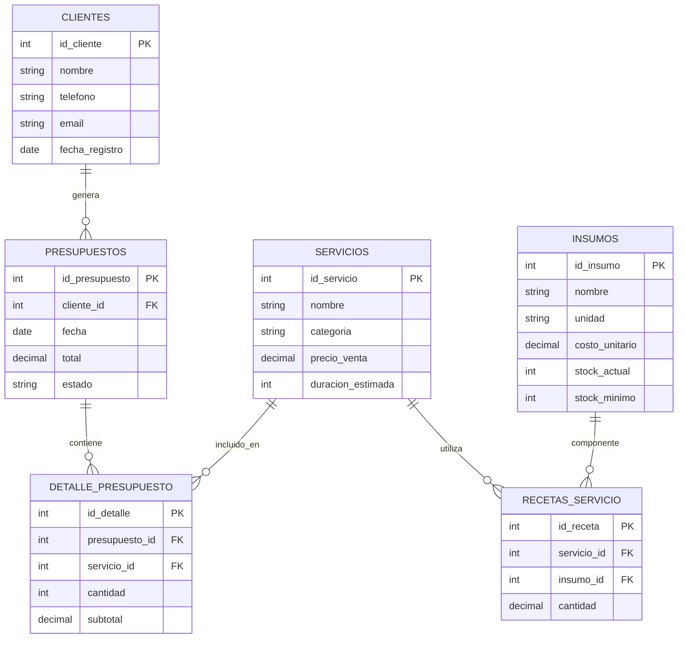

# 💇‍♀️ Sistema de Gestión y Análisis para Peluquería

# 📑 Índice

- [📖 Descripción](#-descripción)
- [🎯 Objetivos](#-objetivos)
- [🧩 Modelo Conceptual](#-modelo-conceptual)
- [🗂️ Diagrama ERD](#️-diagrama-(erd))
- [🗃️ Modelo Relacional](#️-modelo-relacional)
- [💻 Consultas SQL](#-consultas-sql)
- [📊 KPIs](#-kpis)
- [🛣️ Roadmap](#️-roadmap)
- [⚙️ Stack Tecnológico](#️-stack-tecnológico)
- [🧠 Enfoque Analítico](#️-enfoque-analítico)
- [🚀 Estado del Proyecto](#-estado-del-proyecto)

## 📖 Descripción

Sistema web para cálculo automático de costos, generación de presupuestos y análisis comercial para una peluquería.

El sistema permitirá:

- Calcular el costo real de cada servicio según insumos utilizados.
- Actualizar precios de insumos y recalcular automáticamente.
- Generar y guardar presupuestos.
- Registrar clientes.
- Analizar servicios más vendidos y rentabilidad.
- Obtener métricas comerciales para toma de decisiones.

---

## 🎯 Objetivos

- Estandarizar recetas técnicas de servicios.
- Automatizar el cálculo de costos.
- Registrar historial comercial.
- Obtener datos estructurados para análisis.
- Aplicar conceptos de Data Analytics en una PyME.

---

## 🧱 Modelo Conceptual

### 1️⃣ Insumos

Materias primas utilizadas en los servicios.

**Ejemplos:**
- Tintura
- Peróxido
- Shampoo
- Polvo decolorante
- Acondicionador
- stock_actual
- stock_minimo
- fecha_actualizacion

**Atributos:**
- `id`
- `nombre`
- `unidad` (gr, ml, unidad)
- `costo_unitario`

---

### 2️⃣ Servicios

Servicios ofrecidos por la peluquería.

**Ejemplos:**
- Raíces normal
- Color completo – una médula – largo
- Mechas – mucho cabello – doble médula
- Decoloración global
- precio_venta
- duracion_estimada

**Atributos:**
- `id`
- `nombre`
- `categoria`

---

### 3️⃣ Recetas

Relación entre servicios e insumos.

Cada servicio utiliza uno o varios insumos con cantidades específicas.

**Atributos:**
- `id`
- `servicio_id` (FK)
- `insumo_id` (FK)
- `cantidad`

### Fórmula de Cálculo

Costo del servicio:

Costo = Σ (cantidad_insumo × costo_unitario)

---

### 4️⃣ Clientes

Información básica para historial y análisis.

**Atributos:**
- `id`
- `nombre`
- `telefono`
- `email`
- `fecha_registro`

---

### 5️⃣ Presupuestos

Registro de presupuestos generados.

**Atributos:**
- `id`
- `cliente_id` (FK)
- `fecha`
- `total`
- `estado` (presupuestado / confirmado / cancelado)

---

### 6️⃣ Detalle_Presupuesto

Servicios incluidos dentro de cada presupuesto.

**Atributos:**

- id
- nombre
- unidad
- costo_unitario
- stock_actual
- stock_minimo
- fecha_actualizacion

---

## 🗂️ Diagrama (erd)



El modelo entidad–relación representa las relaciones entre clientes, servicios, insumos y presupuestos.
Las recetas técnicas permiten calcular automáticamente el costo de cada servicio según los insumos utilizados.

---

## 🗄️ Modelo Relacional

- Un servicio tiene muchos insumos (vía receta).
- Un cliente puede tener muchos presupuestos.
- Un presupuesto puede incluir muchos servicios.
- Cada servicio puede aparecer en muchos presupuestos.

---

## 🧮 Consulta SQL

Costo total por servicio:

```sql
SELECT 
    s.nombre,
    SUM(r.cantidad * i.costo_unitario) AS costo_total
FROM receta_servicio r
JOIN insumos i ON r.insumo_id = i.id
JOIN servicios s ON r.servicio_id = s.id
GROUP BY s.nombre;
```

---

Servicio más vendido:

```sql
SELECT s.nombre, SUM(d.cantidad) AS total_vendido
FROM detalle_presupuesto d
JOIN servicios s ON d.servicio_id = s.id
GROUP BY s.nombre
ORDER BY total_vendido DESC;
```

---

Ingresos por mes:

```sql
SELECT 
    MONTH(fecha) AS mes,
    SUM(total) AS ingresos
FROM presupuestos
GROUP BY mes;
```

---

## 📊 KPIs

**Comerciales**
- Servicio más vendido
- Ticket promedio
- Clientes recurrentes
- Ingresos mensuales
- Tasa de conversión (presupuesto → confirmado)

**Financieros**
- Costo promedio por servicio
- Margen bruto por servicio
- Insumo más utilizado
- Impacto de aumento de costos

---

## 🚀 Roadmap

**Fase 1 – Modelado**
- Normalización de insumos.
- Diseño de base de datos.
- Carga de recetas base.

**Fase 2 – Sistema de Costos**
- Cálculo automático por receta.
- Actualización dinámica de costos.

**Fase 3 – Gestión Comercial**
- Registro de clientes.
- Generación y guardado de presupuestos.
- Historial de ventas.

**Fase 4 – Análisis de Datos**
- Consultas SQL avanzadas.
- Exportación a Python (Pandas).
- Dashboard de métricas.

---

## 🛠️ Stack Tecnológico

- Backend: Python
- Base de datos: MySQL
- Frontend: HTML + CSS
- Análisis: Pandas
- Visualización futura: Power BI / Tableau (opcional)

---

## 🧠 Enfoque Analítico

Este proyecto busca transformar recetas técnicas en datos estructurados para:

- Analizar rentabilidad.
- Optimizar precios.
- Detectar patrones de consumo.
- Aplicar pensamiento de Data Analytics en un negocio real.


---


## 📌 Estado del Proyecto

En etapa de diseño y modelado de datos.
